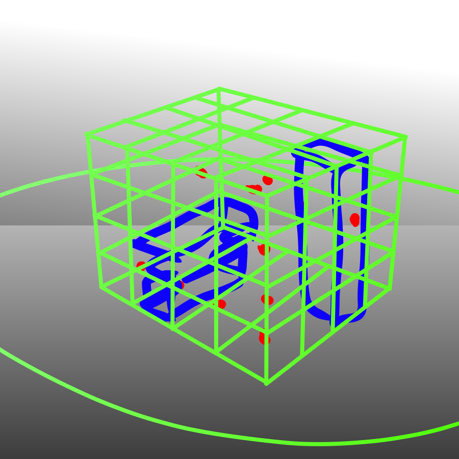

3dattleship

Author: Rafael Rivera

Design: similar concept to battleship, but you place shapes in 3d space and attack a line along the x/y/z axis. I did not have time to complete my game this week either (apologies, had a few other final projects to submit.)

Networking: It does not D:

Screen Shot:

How To Play: (would be) mouse controlled, click to drag the 3d representation of the current game state around to view it from angles (fixed radius away from center.) click the outside to select a row/column to attack.

Sources: N/A

This game was built with [NEST](NEST.md).

